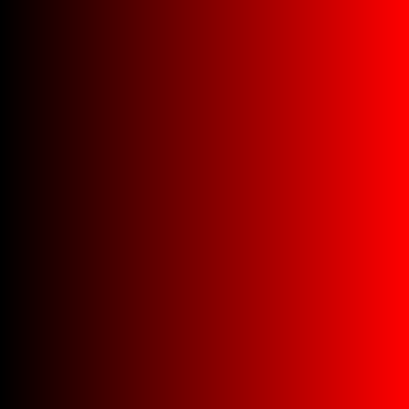
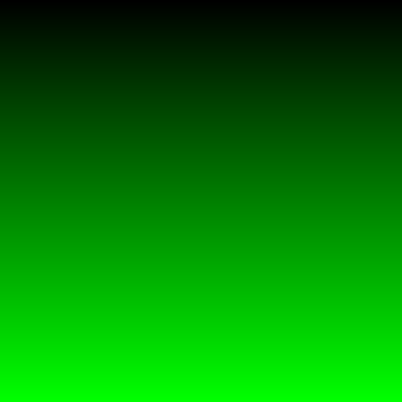

# Making Our First Image

We learned how to read text from the keyboard. We learned how to read a whole line of text from the keyboard. We figured out how to open a file and read it line by line. And we know how to write text into a file.

How hard can it be to create an image?

It actually isn't that hard and thanks to the library [GraphicsMagick](https://en.wikipedia.org/wiki/GraphicsMagick), it is very easy to write our files into our favorite image format. The library knows how to save images into 200 different image file formats, including our favorites [JPEG](https://en.wikipedia.org/wiki/JPEG), [GIF](https://en.wikipedia.org/wiki/GIF), and [PNG](https://en.wikipedia.org/wiki/Portable_Network_Graphics).

Our goal is to create an image that looks like the one below.


The image is composed of three different channels or colors. The channels are red, green, and blue. To help you visualize how the image is created let's look at each color channel separately. Look at the images critically. How do the images change horizontally (the x direction) and vertically (the y direction)? Is the color the same all the way across? Does the color change as you move from the top to the bottom?


### Debugging Image, Red Channel Only



Look at how the red color changes as we move from the left edge to the right edge of the image. Notice that each row of pixels starts as black (no red, no green, no blue) and gradually turns into read (all red, no green, no blue). The color smoothly changes with no visible bands or steps.

### Debugging Image, Green Channel Only



Similar to the red image, the green image changes. The green images changes as we move from the top edge to the bottom edge of the image. Notice how each column of pixels starts as green (no red, all green, no blue) and gradually changes to black (no red, no green, no blue). The color smoothly changes with no visible bands or steps just like the red image.

### Debugging Image, Blue Channel Only


Unlike the red and green image, the blue image is the same color at every single pixel. Look in the center, at the left edge, the right edge, the top, and bottom edge and you'll see the same shade of blue. This means that the color is not changing and it is staying constant (same red, same green, same blue) at every pixel.

### Sample Output Image, All Channels


By combining the three channels together, a beautiful gradient is created. The image is created by smoothly changing the red in the horizontal direction (x direction), smoothly changing the green in the vertical direction (y direction), and keeping the blue channel the same.

How do you think we can make an image like this? If we could have a loop that changes the red color and another loop that changes the green color we could achieve the effect we are interested in.

We can imagine an image as being a grid and in each grid cell (a pixel) we can fill it with color. If we imagine the image as a grid then the grid has rows and columns. The rows are the cells that go from left to right (x direction) and the columns are the cells that run from the top to the bottom (y direction).

Furthermore, an image has a width and a height expressed as an integer. If we say an image has 3 width and 2 height, then there are a total of 6 grid cells, 2 rows with 3 cells each, and 3 columns with 2 cells each. The image that we will be creating is 512 pixels by 512 pixels. (You can experiment with larger images if you'd like.)

Let's make an outer for loop which will count down the rows. The loop starts from the height - 1 and counts down towards 0. The inner loop counts the number of columns starting at 0 and counting up towards width.

Inside the loop, we will assign different colors to the 3 color channels, red, green, and blue. First with the red channel we will assign it the ratio of the current row / (width - 1). Then for the green channel we will assign it the ratio of the current columnt / height - 1. The blue channel will stay a consistent 0.25.

Most image file formats cannot understand color as a floating point number. Thankfully, GraphicsMagick can gracefully handle our floating point colors. A channel has no color when the value of the channel is zero and is fully _on_ when the value of the channel is one. In other words, a color can only have values between 0 and 1, 0 <= color <= 1.

The sample code below demonstrates how a white image is created and one of it's pixels is changed to purple.
```c++
	// The width and height of our image
	const int kImageWidth = 512;
	const int kImageHeight = 512;
	// Create a GraphicsMagick color variable set to white.
	ColorRGB white(1, 1, 1);
	// Create a new image that is 512 x 512 pixels and set every
	// pixel to white.
	Image image(Geometry(kImageWidth, kImageHeight), white);
	double red = 0.5;
	double green = 0.0;
	double blue = 0.5;
	// Create a new GraphicsMagick color variable - the color is purple
	ColorRGB color(red, green, blue);
	int row = kImageWidth / 2;
	int column = kImageHeight / 2;
	// Set the pixel in the center of the image to purple
	image.pixelColor(row, column, color);
```

## Requirements

Use GraphicsMagick to create an image as described above.

Review the C++ source files and identify all the TODOs. Remember you can always check your application using `make test`.

To compile your program, you use the `make` command. A Makefile is provided for this exercise.

The Makefile has the following targets:
  
* all: builds the project
* clean: removes object and dependency files
* spotless: removes everything the clean target removes and all binaries
* format: outputs a [`diff`](https://en.wikipedia.org/wiki/Diff) showing where your formatting differes from the [Google C++ style guide](https://google.github.io/styleguide/cppguide.html)
* lint: output of the [linter](https://en.wikipedia.org/wiki/Lint_(software)) to give you tips on how to improve your code
* header: check to make sure your files have the appropriate header
* test: run tests to help you verify your program is meeting the assignment's requirements. This does not grade your assignment.
* unittest: run unit tests to verify parts of your program performs according to the instructor supplied unit tests.
* doc: generate the project's documentation from the source files and store it in the directory named `doc`.


## Don't Forget

Please remember that:

- You need to put a header in every file.
- You need to follow the [Google C++ Style Guide](https://google.github.io/styleguide/cppguide.html).
- Remove the `TODO` comments.

## Testing Your Code

Computers only ever do exactly what they are told, exactly the way they are told it, and never anything else. Testing is an important process to writing a program. You need to test for the program to behave correctly and test that the program behaves incorrectly in a predictable way.

As programmers we have to remember that there are a lot of ways that we can write the wrong program and only one to a few ways to write the correct program. We have to be aware of [cognitive biases](https://en.wikipedia.org/wiki/List_of_cognitive_biases) that we may exercise that lead us to believe we have correctly completed our program. That belief may be incorrect and our software may have errors. [Errors in software](https://www.wired.com/2005/11/historys-worst-software-bugs/) may lead to loss of [life](https://www.nytimes.com/2019/03/14/business/boeing-737-software-update.html), [property](https://en.wikipedia.org/wiki/Mariner_1), [reputation](https://en.wikipedia.org/wiki/Pentium_FDIV_bug), or [all of the above](https://en.wikipedia.org/wiki/2009%E2%80%9311_Toyota_vehicle_recalls).

### Test strategy

Start simple, and work your way up. Good tests are specific, cover a broad range of fundamentally different possibilities, can identify issues quickly, easily, and directly, without need for much set up, and can almost be diagnosed by inspection if the code fails to execute the test correctly.

## Example Output

Please ensure your program's output is identical to the example below.

```
$ make unittest
set -e; clang++ -MM -g -O3 -Wall -pipe -std=c++17 -D LINUX -I/usr/include/GraphicsMagick -D AMD64 gradient_functions.cc \
| sed 's/\(gradient_functions\)\.o[ :]*/\1.o gradient_functions.d : /g' > gradient_functions.d; \
[ -s gradient_functions.d ] || rm -f gradient_functions.d
set -e; clang++ -MM -g -O3 -Wall -pipe -std=c++17 -D LINUX -I/usr/include/GraphicsMagick -D AMD64 gradient.cc \
| sed 's/\(gradient\)\.o[ :]*/\1.o gradient.d : /g' > gradient.d; \
[ -s gradient.d ] || rm -f gradient.d
rm: cannot remove 'unittest': No such file or directory
rm: cannot remove 'test_detail.json': No such file or directory
make: [Makefile:142: cleanunittest] Error 1 (ignored)
clang++ -g -O3 -Wall -pipe -std=c++17 -D LINUX -I/usr/include/GraphicsMagick -D AMD64 -c gradient_functions.cc
Running main() from /build/googletest-j5yxiC/googletest-1.10.0/googletest/src/gtest_main.cc
[==========] Running 2 tests from 1 test suite.
[----------] Global test environment set-up.
[----------] 2 tests from HasMatchingFileExtension
[ RUN      ] HasMatchingFileExtension.Exists
[       OK ] HasMatchingFileExtension.Exists (1 ms)
[ RUN      ] HasMatchingFileExtension.NotExist
[       OK ] HasMatchingFileExtension.NotExist (0 ms)
[----------] 2 tests from HasMatchingFileExtension (1 ms total)

[----------] Global test environment tear-down
[==========] 2 tests from 1 test suite ran. (1 ms total)
[  PASSED  ] 2 tests.
$ make
clang++ -g -O3 -Wall -pipe -std=c++17 -D LINUX -I/usr/include/GraphicsMagick -D AMD64 -c gradient.cc
clang++ -g -O3 -Wall -pipe -std=c++17 -lGraphicsMagick++ -o gradient gradient.o gradient_functions.o 
$ ./gradient 
Please provide a path to a file.
$ ./gradient output_image.bmp
output_image.bmp is missing the required file extension .png.
$ ./gradient output_image.png
$ xdg-open output_image.png 
```

In the example above, the image is saved to `output_image.png`. To view the image, you can use the command `xdg-open output_image.png`. This will open the image in your default image viewer.
